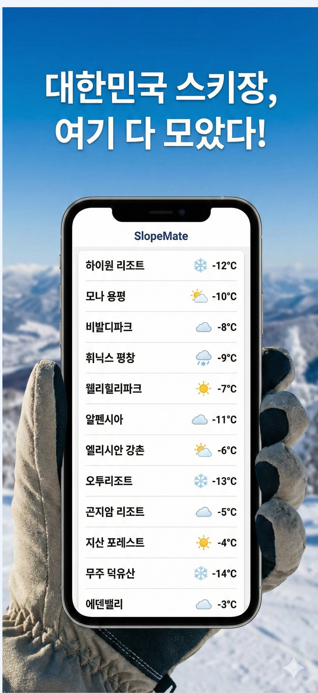
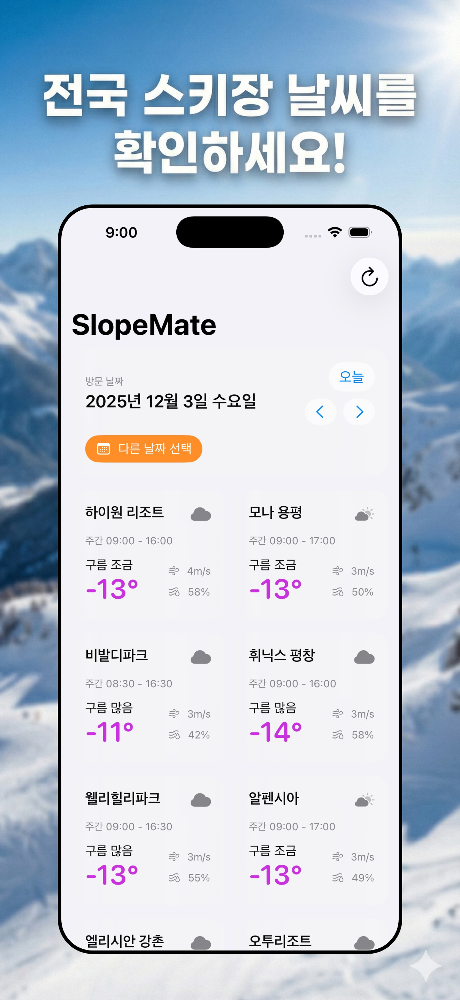
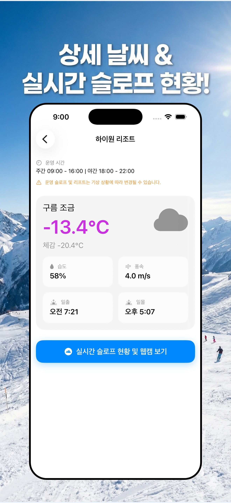

<div align="center">

# SlopeMate ⛷️  
Real-time weather & slope companion for Korean ski resorts

</div>

SlopeMate is a SwiftUI iOS app that surfaces live weather and operating info for 12 major Korean ski resorts. It highlights daily forecasts (today + 7 days), strong-wind alerts, operating hours, and links to official slope/webcam pages.

---

## Highlights
- **Live weather** powered by OpenWeatherMap One Call 3.0 (current, forecast, historical)
- **Date window enforcement**: only today → +7 days in KST
- **Strong-wind alert** when wind speed ≥ 10 m/s
- **Operating hours** for day/night/late-night shifts
- **Slope + webcam links** via `SFSafariViewController`
- **12 resorts covered** including High1, Yongpyong, Vivaldi Park, Phoenix Pyeongchang, etc.

---

## Tech Stack
| Area | Stack |
| --- | --- |
| UI | SwiftUI, SF Symbols, LazyVGrid |
| State | `@Observable` (iOS 17) |
| Network | `URLSession`, `async/await` |
| Architecture | MVVM (DateManager, ResortWeatherStore) |
| Other | SFSafariViewController, One Call API 3.0 |

---

## Getting Started

1. **Clone the repo**
   ```bash
   git clone https://github.com/USERNAME/SlopeMate.git
   cd SlopeMate
   ```

2. **Add your OpenWeatherMap API key**
   - Requires One Call API 3.0 (paid plan)
   - Copy the provided template and insert your key
     ```bash
     cp SlopeMate/Info.plist.example SlopeMate/Info.plist
     open SlopeMate/Info.plist
     # replace OPEN_WEATHER_API_KEY with your real key
     ```
   - For device builds you can also set it under Xcode ▸ Target ▸ Info.

3. **Run in Xcode**
   - `SlopeMate.xcodeproj` 열기
   - Scheme: `SlopeMate`
   - Device: iPhone (iOS 17.6+)
   - `⌘R` 실행

---

## Project Structure
```
SlopeMate/
├─ Models/        # Resort / Weather models
├─ ViewModels/    # DateManager / ResortWeatherStore
├─ Views/         # HomeView / ResortDetailView / SafariView / WeatherIconView
├─ Services/      # WeatherService (OpenWeatherMap client)
└─ Assets/        # App icon, colors, screenshots
```

---

## Environment & Security
- `SlopeMate/Info.plist` is gitignored to keep secrets out of VCS.
- Use `Info.plist.example` as the template for your local key.
- `ITSAppUsesNonExemptEncryption = false` is set for export compliance.

---

## TODO / Roadmap
- [ ] Lock screen / Home widget (next-visit weather)
- [ ] iPad layout polish
- [ ] Multi-language support (EN)
- [ ] Favorite resorts & quick filter

---

## Screenshots
| Home | Resort Detail | Slope/Webcam |
| --- | --- | --- |
|  |  |  |

---

## Contact
- **Email**: pjh030331@gmail.com
- **Docs**: `https://woolly-devourer-5d2.notion.site/2be3ed084bab800b8544cbc4a1140929`

---

> Check the slopes before you leave home—SlopeMate keeps your ski days safe and smooth!

